# Xadrez em Console

###### Um jogo de xadrez feito em console com fins para aprendizagem realizado durante meu curso de C#.

## Peças do tabuleiro

- Todas peças do tabuleiro possuem sua própria lógica implementada em sua classe, com todos os movimentos possíveis de ambos lados, e são representados pela letra correspondete a inicial do seu nome: Torre(T), Cavalo(C), Bispo(B), Dama(D), Rei(R), Peão(P).

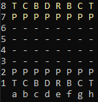

## Movimentação

- A movimentação do jogo é feita pela inserção de uma e um número que representa a posição da casa onde está a peça que queres mover, em seguida a posição da casa que representa onde queres colocar a peça, juntamente com um auxílio que indica quais as posições possíveis para se colocar a peça.

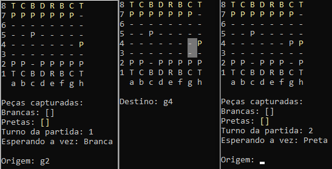

- Cada peça possui sua própria movimentação, e o sistema do jogo indica qual casas são válidas para aquela peça se mover.

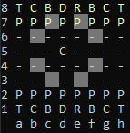
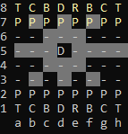

                                                                                                                    
## Movimentos especiais 

#### En Passant
- En passant é um movimento especial de captura do Peão no jogo de xadrez. Na ocasião do avanço por duas casas do peão, caso haja um peão adversário na coluna adjacente na quarta fileira para as brancas, ou quinta para as pretas, este pode capturar o peão como se "de passagem", movendo-o para a casa por onde o peão capturado passou sobre (Kenneth: The Oxford Companion to Chess - 1992).

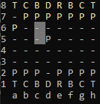
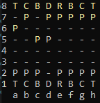
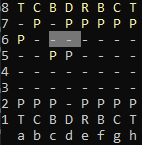
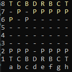

#### Roque
- O movimento consiste no deslocamento lateral do rei na primeira fileira em duas casas na direção na torre com a qual desejar "rocar", e a torre passa através do rei permanecendo na primeira casa após o "salto".

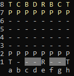
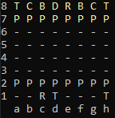
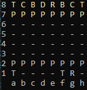

#### Promoção
- Promoção é uma regra do xadrez que descreve a transformação de um peão que alcança a oitava fileira em uma se torna a Dama, no caso desse jogo que eu desenvolvi. A nova peça substitui o peão na mesma casa que concluiu o movimento.

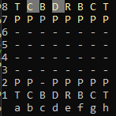
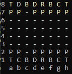

## O sistema do jogo
- O sistema do jogo conta com a representações do turno atual, a quantidade de momevimentos da partida e as peças capturadas de cada cor, além de vários tratamentos para jogadas inválidas.

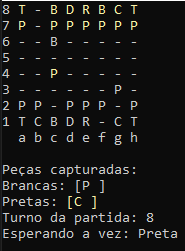
